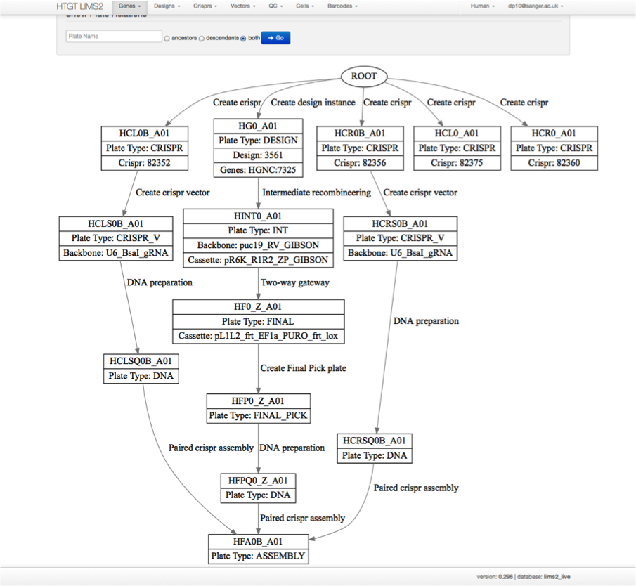

# LIMS2-WebApp

LIMS2 (Laboratory Information Management System 2) is a graph-based tracking system for 'wells'
that exist in a hierarchichal parent:child relationship with each other. The nodes of the graph
are well objects (wells) and the edges of the graph connecting wells are process objects (processes).
The process linking two wells determines which input and output well object types are valid for that process.

Wells are grouped together into plates. Plates may contain any number of wells. Typical real lab plates contain 12, 96 or 384 wells. However, LIMS2 only uses plates as a means of grouping wells and imposes no constraints on well numbers. Plates do not
necessarily contain the same types of well - although generally they do and the user interface does not provide facilities
for creating single plates with different well types.

Plates that do not map onto physical plates in a freezer are termed virtual plates. Virtual plates enable many transformations
on wells that assist management of LIMS data.

LIMS2 provides flexible reporting over wells in the system, including pictorial representations of the process graph. Using this,
users can investigate the series of changes that have been applied to a well from its inception (as a design well) to its acceptance for distribution.

LIMS2 supports a variety of quality control checking methods. Multiple QCs may be applied to individual wells. Informative visualisation of QC is available for Vector, Emryonic Stem Cell QC and CRISPR validation/CRISPR offsite damage QC.

LIMS2 integrates the Genoverse genome browser to display Gibson designs, PCR and sequencing primers, Ensembl information and so on.

LIMS2 is a three tier webapp based on PostgreSQL, Perl (with ORM DBIx::class), and template toolkit - fully supporting the Model-view-controller MVC pattern. It is a production quality system in everyday use at the Wellcome Trust Sanger Institute supporting the high-throughput gene targting efforts in human and mouse cells. Many user facilities make extensive use of Javascript and the ExtJS Gridpanel widget is used as one method of viewing plate output reports on an essentially infinitely scrolling canvas.

Cellular Informatics Team

